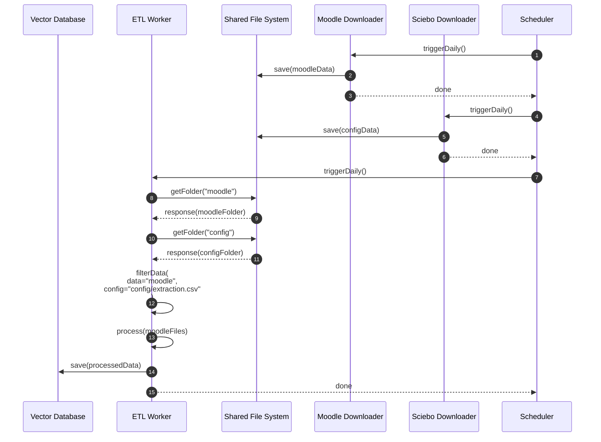
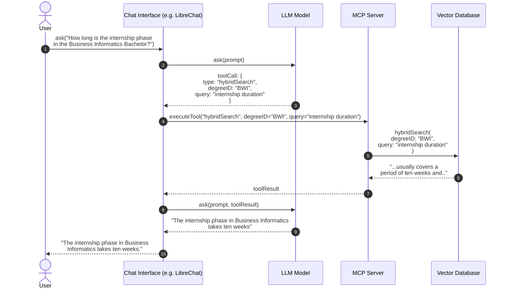

# fachbereich-chatbot

> ⚠️ **Work in Progress** — This project is under active development and **not production-ready**. Major changes to the architecture, configuration, and interfaces are still possible at any time.

A Retrieval-Augmented Generation (RAG) chatbot pipeline for university faculties. It continuously downloads Moodle course content, processes it into a searchable vector database (Qdrant), and exposes it to any LLM-based chat client through an MCP (Model Context Protocol) server. The system is designed so that faculties can adapt it to their own Moodle instance and degree programs with minimal effort.

## How it works

- **moodle-dl** — downloads all whitelisted Moodle courses (files, descriptions, forums) once per day into a shared Docker volume.
- **ETL-Worker** — extracts relevant files based on configuration rules, converts them (via [IBM Docling](https://github.com/DS4SD/docling)) into structured Markdown, chunks and embeds them, and stores them in Qdrant. Changed, new, and removed files are detected automatically, so the database stays in sync with Moodle.
- **MCP-Server** — provides tools (hybrid dense/sparse search, study program listings, faculty contact points, direct file access) over the processed data to any MCP-compatible client. It is exposed via **SSE (Server-Sent Events)** on port 9001 and is intentionally decoupled from any specific chat UI — it can be integrated into LibreChat (see below) or any other MCP-capable frontend.
- **Qdrant** — vector database storing the embedded course content.
- **Sciebo sync (optional)** — syncs the configuration CSVs from a Sciebo/Nextcloud folder, so non-technical staff can edit them comfortably (e.g. in Excel).
- **LibreChat (optional, testing)** — a ready-to-use chat UI that connects to the MCP server and an LLM endpoint of your choice.

The two sequence diagrams below illustrate the core workflows of the system:

1. **Data pipeline (daily)** — a scheduler (Ofelia) triggers the Moodle download and the Sciebo config sync, which write into shared Docker volumes. The ETL-Worker then picks up the downloaded Moodle data plus the config CSVs, filters and processes the relevant files, and stores the result in the vector database.
2. **Query flow (per user question)** — a user asks the chat interface a question; the LLM decides to call the MCP server's hybrid search tool, which retrieves the most relevant content (filtered by degree program) from the vector database and feeds it back to the LLM to compose the final answer.

### Daily data pipeline (ingestion)



### Query flow (answering a user question)



## Prerequisites

- [Docker](https://docs.docker.com/get-docker/) and Docker Compose (v2, included in recent Docker Desktop / Engine versions)
- A Moodle account with access to the courses you want to index
  > **Recommendation:** Create a **dedicated service account** for this purpose instead of using a personal account. No special permissions are required — the account only needs access to the courses whose files should be ingested. Every course the account can see can be whitelisted.
- Optionally: a Sciebo or Nextcloud account for the config sync (see below)
- Optionally: an LLM provider API endpoint for testing with LibreChat

## Quick Start

### 1. Clone the repository

The repo contains two Git submodules (Moodle-DL and LibreChat), so make sure to clone them too:

```bash
git clone --recurse-submodules https://github.com/digilab08/fachbereich-chatbot
cd fachbereich-chatbot
```

If you already cloned without submodules, run:

```bash
git submodule update --init --recursive
```

### 2. Set up environment variables

Copy the example file at the repository root:

```bash
cp .env.example .env
```

Then edit `.env`:

| Variable          | Description                                                                                                                                     |
| ----------------- | ----------------------------------------------------------------------------------------------------------------------------------------------- |
| `NC_URL`          | URL of your Sciebo/Nextcloud WebDAV endpoint. Must end with `/remote.php/webdav/` (e.g. `https://hs-niederrhein.sciebo.de/remote.php/webdav/`). |
| `NC_USER`         | Your Sciebo/Nextcloud username.                                                                                                                 |
| `NC_PASS`         | Your Sciebo/Nextcloud **app password** (see step 4).                                                                                            |
| `NC_SUBFOLDER`    | Subfolder in your Sciebo/Nextcloud where the config CSVs live.                                                                                  |
| `MCP_SERVER_NAME` | Name of the MCP server as exposed to clients (e.g. `HSNR-FB08-MCP`).                                                                            |
| `MOODLE_URL`      | URL of your Moodle instance (e.g. `https://moodle.hsnr.de`).                                                                                    |

### 3. Configure Moodle-DL

Run the interactive setup for the Moodle downloader:

```bash
docker compose run --rm moodle-dl --init
```

Follow the prompts:

- Skip any connections to e-mail, Telegram, etc. (not needed).
- Enter your Moodle URL, username, and password (use the dedicated service account, see Prerequisites).
- When asked if you want to do more settings, pick **Yes**:
  - In the extended settings, choose the courses you want to sync in the **whitelist**. Only whitelisted courses will be downloaded and indexed.
  - Recommended answers for the remaining questions:

    | Question                                                                  | Recommended answer                                                        |
    | ------------------------------------------------------------------------- | ------------------------------------------------------------------------- |
    | For which of the following courses do you want to change the settings?    | None                                                                      |
    | Do you want to download submissions of your assignments?                  | No                                                                        |
    | Would you like to download descriptions of the courses you have selected? | Yes                                                                       |
    | Would you like to download links in descriptions?                         | No                                                                        |
    | Do you want to download databases of your courses?                        | No                                                                        |
    | Do you want to download forums of your courses?                           | Yes (irrelevant ones can be filtered out later via the extraction config) |
    | Do you want to download quizzes of your courses?                          | No                                                                        |
    | Do you want to download lessons of your courses?                          | No                                                                        |
    | Do you want to download workshops of your courses?                        | No                                                                        |
    | Do you want to download books of your courses?                            | No                                                                        |
    | Do you want to download calendars of your courses?                        | No                                                                        |
    | Would you like to download linked files of the courses you have selected? | No                                                                        |
    | Would you like to download files for which a cookie is required?          | No                                                                        |

If you skipped this during init or want to change it later:

```bash
docker compose run --rm moodle-dl --config
```

For problems with this container, see the [Moodle-DL documentation](https://github.com/C0D3D3V/Moodle-DL).

### 4. Configure the config files (Sciebo sync)

The system's behavior is controlled by three CSV files (see [Configuration Files](#configuration-files) for their schemas). By default, these are stored in a **Sciebo or Nextcloud folder** and synced into the containers, so multiple people (e.g. faculty staff) can edit them easily — the CSVs open fine in Excel.

**To create an app password for the sync:**

1. Open your Sciebo/Nextcloud web interface.
2. Go to **Settings → Security**.
3. Under **Devices & sessions / App passwords**, create a new app password and use it as `NC_PASS` in your `.env`.
4. Make sure `NC_URL` ends with `/remote.php/webdav/` and `NC_SUBFOLDER` points to the folder containing the CSVs.

Place the three CSV files (`extraction_config.csv`, `contact_points.csv`, `study_programs.csv`) in that folder.

**Alternative for local testing:** If you don't want to use Sciebo, uncomment the local bind mounts in `docker-compose.yml` (the lines referencing `./sciebo-example-data`) instead of the `sciebo-data` volume for the `etl-worker` and `mcp-server` services. Example data for a working setup is provided in [`sciebo-example-data/`](sciebo-example-data).

### 5. Start the stack

```bash
docker compose up -d
```

What happens next:

- The **sciebo-sync** container performs an initial sync of the config CSVs, then re-syncs daily at 03:00.
- The **moodle-dl** container performs its first Moodle download, then re-syncs daily at 03:00.
- The **ETL-Worker deliberately waits 15 minutes** before its first run. This gives the initial Sciebo sync and Moodle download time to finish, so the worker doesn't start on an empty data folder. After that, it converts and indexes everything.
- **The first run can take a long time** depending on the number and size of courses — it downloads and processes all whitelisted content from scratch.

Check progress with:

```bash
docker compose logs -f etl-worker
docker compose logs -f moodle-dl
```

### 6. Inspecting Qdrant (optional)

For debugging, Qdrant's web dashboard is available at [http://localhost:6333/dashboard](http://localhost:6333/dashboard).

> ⚠️ **Security note:** The Qdrant REST (6333) and gRPC (6334) ports are only exposed for debugging during setup. **Do not expose them in production** — comment out the `ports` section of the `qdrant` service in `docker-compose.yml` before deploying to a server, so the database is only reachable from within the Docker network.

## Configuration Files

All three files are CSVs and can be edited with Excel, LibreOffice Calc, or any text editor. They live in your Sciebo/Nextcloud folder (synced automatically) or, for local testing, in `sciebo-example-data/`. After editing, the next daily sync (03:00) picks them up; a restart of the stack forces an immediate re-sync.

### `extraction_config.csv` — which Moodle content to index, and for which program

Controls what the ETL-Worker ingests. Columns:

| Column   | Meaning                                                                                                                                                                                                                                                                                      |
| -------- | -------------------------------------------------------------------------------------------------------------------------------------------------------------------------------------------------------------------------------------------------------------------------------------------- |
| `source` | Path inside the downloaded Moodle data (relative to the data root), starting with `moodle/`. Subfolders below the Moodle room name mirror the folders and sections created in the Moodle room itself. Example: `moodle/<Room Name>/<Section>/<Subsection>`. Can also point to a single file. |
| `target` | What this content belongs to: either a **degree program abbreviation** (e.g. `BWL`, `IMB`) or the **overarching department/faculty code** (e.g. `FB08`, see `study_programs.csv`). Only rows with an `ignore` action (see below) should normally have an empty `target`.                     |
| `action` | Leave **empty** to include the path, or set to `ignore` to explicitly exclude it. The last row of the file must be a catch-all baseline rule (e.g. `,,ignore`) that applies to everything not matched by any more specific rule.                                                             |

**Matching rules:**

- The **most specific path wins** for each file. A rule for a whole Moodle room applies to everything in it, unless a more specific rule (section, subfolder, or even a single file) overrides it.
- Folders without any matching rule **inherit the setting of their parent folder**. There is therefore no need to list every subfolder explicitly — only define rules where the assignment changes.
- A **baseline rule at the end of the file is mandatory** so that unmatched data has a defined default:
  - `,,ignore` — everything not matched elsewhere is ignored (**recommended**). ⚠️ Do not use a catch-all `target` instead: the Moodle-DL data folder also contains internal files (e.g. its own database), which would otherwise be indexed.

**How to add rules:**

- To index an entire Moodle room for one program, add a row with the room path and the target:
  `moodle/My Course Room,BWL,`
- The target can also be the department/faculty code for content relevant to the whole faculty:
  `moodle/General Information,FB08,`
- To index only one section or subfolder of a room, use the full subpath:
  `moodle/My Course Room/Week 1,BWL,`
- To assign a **single file** to a program, point the path directly at the file:
  `moodle/My Course Room/Overview/exam_rules.pdf,BWL,`
- To exclude a subfolder from an otherwise included tree, add an `ignore` row — more specific paths win:
  `moodle/My Course Room/General/Newsletter,,ignore`

Example row set (from `sciebo-example-data/extraction_config.csv`):

```csv
source,target,action
moodle/Allgemeine und studiengangübergreifende Informationen für alle Studierenden,FB08,
moodle/Allgemeine und studiengangübergreifende Informationen für alle Studierenden/Bachelor Betriebswirtschaftslehre,BWL,
moodle/Allgemeine und studiengangübergreifende Informationen für alle Studierenden/Allgemein/Newsletter,,ignore
```

### `study_programs.csv` — the degree programs

Defines all known study programs and how specific variants map to overarching programs. Columns:

| Column                                    | Meaning                                                                                                                                                                                             |
| ----------------------------------------- | --------------------------------------------------------------------------------------------------------------------------------------------------------------------------------------------------- |
| `abbreviation`                            | The abbreviation under which the study program is known (e.g. `BWL`, `BBWD`). In `extraction_config.csv`, either this abbreviation or the overarching program abbreviation can be used as `target`. |
| `full name`                               | Human-readable program name (e.g. `Bachelor Betriebswirtschaft (Dual)`).                                                                                                                            |
| `department`                              | Department the program belongs to (e.g. `FB08`).                                                                                                                                                    |
| `overarching degree program abbreviation` | Groups variants of the same program together (e.g. `BBW`, `BBWD`, and `BBS` all map to `BWL`).                                                                                                      |

**How to add a program:**

1. Use a unique `abbreviation`.
2. Add a row with the full name and department.
3. If it's a variant of an existing program (e.g. a dual or part-time version), set the `overarching degree program abbreviation` to that program's code; otherwise set it to the new abbreviation itself.
4. In `extraction_config.csv`, use either the abbreviation or its overarching program abbreviation as `target` for the relevant Moodle rooms.

### `contact_points.csv` — faculty contact persons

Powers the chatbot's ability to answer "who do I contact for …?" questions. Columns:

| Column            | Meaning                                                                                                                                   |
| ----------------- | ----------------------------------------------------------------------------------------------------------------------------------------- |
| `target`          | Degree program abbreviation this contact belongs to (e.g. `BWL`), or the department/faculty code (e.g. `FB08`) for faculty-wide contacts. |
| `Role_Department` | What the contact is responsible for (e.g. `Prüfungsamt`, `Studiengangleitung`).                                                           |
| `Name`            | Contact name(s); multiple names separated by commas.                                                                                      |
| `Email`           | Contact e-mail address.                                                                                                                   |
| `Phone`           | Phone number (optional).                                                                                                                  |
| `Location`        | Building/room address (optional).                                                                                                         |

**How to add a contact point:** Add one row per contact with the appropriate `target` (faculty-wide → `FB08`, program-specific → the program abbreviation), fill in the fields, and leave unknown fields empty.

## Testing with LibreChat

For a quick end-to-end test of the whole pipeline, you can run [LibreChat](https://github.com/danny-avila/LibreChat) locally alongside the other services. This is intended for **testing only** — remove it in production.

1. Uncomment the `mongodb` and `librechat` service blocks at the end of `docker-compose.yml`.
2. Copy `LibreChat/.env.example` to `LibreChat/.env` and follow the instructions inside to configure **your own LLM provider**. Every deployment must bring its own model/endpoint (e.g. an OpenAI-compatible API).
3. Create a `LibreChat/librechat.yaml` containing at least the following, so LibreChat can reach the MCP server and your LLM endpoint:

   ```yaml
   version: 1.1.5
   cache: true

   mcpSettings:
     allowedAddresses:
       - "mcp-server:9001"

   mcpServers:
     HSNR-FB08-MCP:
       type: "sse"
       url: "http://mcp-server:9001"
   ```

   Adjust the version number to match the one in `LibreChat/librechat.example.yaml`.

4. Start the stack again:

   ```bash
   docker compose up -d
   ```

5. LibreChat is then available at [http://localhost:3080](http://localhost:3080).

## Daily operation & maintenance

| Task                                                          | Command                                                                                                 |
| ------------------------------------------------------------- | ------------------------------------------------------------------------------------------------------- |
| View logs                                                     | `docker compose logs -f <service>`                                                                      |
| Re-run Moodle sync immediately                                | `docker compose run --rm moodle-dl`                                                                     |
| Force config re-sync / restart stack                          | `docker compose restart`                                                                                |
| Change Moodle-DL settings                                     | `docker compose run --rm moodle-dl --config`                                                            |
| Reset Qdrant data (careful: re-index from scratch afterwards) | `docker compose down -v` (⚠️ deletes **all** named volumes including all processed and downloaded data) |

The daily jobs (Moodle download + Sciebo sync) run at 03:00, triggered by [Ofelia](https://github.com/mcuadros/ofelia) labels in `docker-compose.yml`.

## Production considerations

> ⚠️ **Reminder:** The system is **not production-ready yet** — treat everything in this section as guidance for a future production deployment, not as a statement that the current state is suitable for one.

- **Close the Qdrant ports** (6333/6334) to the outside — they are only exposed for debugging.
- Remove the commented-out `mongodb` and `librechat` test services (and the `mongo-data` volume) from `docker-compose.yml`.
- Set up a proper chat deployment (e.g. the `LibreChat/deploy-compose.yml` stack) instead of the test setup, or connect any other MCP-compatible client.
- Restrict access to the MCP server port (9001) to trusted networks/clients.

## Acknowledgements

This project builds on the great work of:

- [Moodle-DL](https://github.com/C0D3D3V/Moodle-DL) — Moodle course downloader
- [LibreChat](https://github.com/danny-avila/LibreChat) — open-source chat UI
- [IBM Docling](https://github.com/DS4SD/docling) — document parsing & conversion
- [Qdrant](https://qdrant.tech/) — vector database
- [FastMCP](https://github.com/jlowin/fastmcp) — MCP server framework

## License

See [LICENSE](LICENSE).
